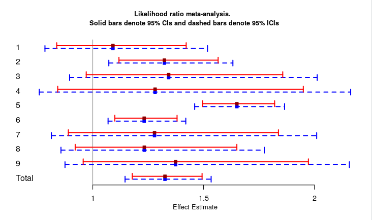

# 'metalr': Likelihood ratio meta-analysis package

[](https://travis-ci.org/LaminJuwara/metalr)


`R` software package to estimate traditional 95% confidence intervals (CIs) and 95% intrinsic confidence intervals (ICIs) based on the likelihood ratio meta-analytic approach proposed by [Dormuth et al., 2016](https://github.com/LaminJuwara/metalr/blob/master/man/documents/Dormuth2016.pdf). In the figure below, we present an example of a forest plot showing 95% CIs and 95% ICIs ( of odds ratio) in a random effect meta-analysis. Individual level effects and cofidence limits of the 9 studies included are shown along with the overall effect estimates.


 


## Overview

The `metalr` package provide functionalities estimating 95% CIs and 95%ICIs of rate ratio or odds ratio in single studies as well as total effect estimates in meta-analysis. The functions included in the R package are
- `ici.or()`
- `ici.rr()`
- `metalr_or()`
- `metalr_rr()`
- `forest_metalr()`

The vignette, accessable using `vignette("metalr")`, contains a detailed description of the functions. Examples of their usage are also presented.


## Installation


The development version of the `metalr` package can be installed from [GitHub](https://github.com/laminjuwara/metalr) using:

```R
if (!require("devtools")) install.packages("devtools")
devtools::install_github("laminjuwara/metalr")
```


## Getting help

* e-mail: <Kristian.Filion@mcgill.ca>
* Pull Requests: <https://github.com/cnodes/metalr/>


## References

1. Dormuth, Colin R., Kristian B. Filion, and Robert W. Platt. "Likelihood ratio meta-analysis: New motivation and approach for an old method." Contemporary clinical trials 47 (2016): 259-265.
